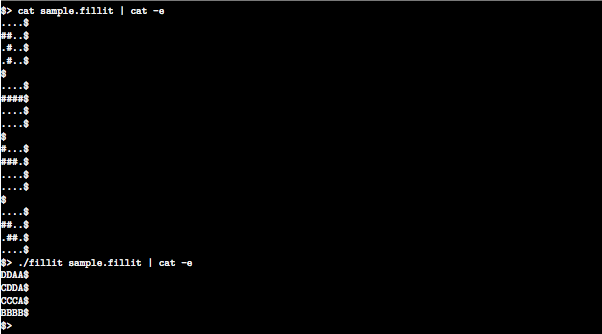

# Fillit - 42 Project.

**Introduction:**

Fillit est un projet vous permettant de decouvrir et/ou de vous familiariser avec une problematique récurrente en programmation : la recherche d’une solution optimale parmi un très grand nombre de possibilités, dans un délai raisonable. Dans le cas de ce projet, il s’agira d’agencer des Tetriminos entre eux et de déterminer le plus petit carré possible pouvant les acueillir.

Un Tetriminos est une figure géométrique formée de 4 blocs que vous connaissez grâce au célèbre jeu Tetris.

**Objectifs:**

Fillit ne consiste pas à recoder Tetris, mais reste une variante du jeu dans l’esprit. Votre programme prendra en paramètre un fichier décrivant une liste de Tetriminos qu’il devra ensuite agencer entre eux pour former le plus petit carré possible. Le but est bien entendu de trouver ce plus petit carré le plus rapidement possible malgré un nombre d’agencements qui croît de manière explosive avec chaque pièce supplémentaire.

**Sortie du programme:**

Votre programme doit afficher le plus petit carré solution sur la sortie standard. Pour
pouvoir identifier chaque Tetriminos dans le carré solution, vous assignerez une lettre
majuscule (en commencant avec ’A’) à ce Tetriminos dans l’ordre où ils apparaissent
dans le fichier de description. Il n’y aura jamais plus de 26 Tetriminos dans un fichier
de description.

**Exemple:**

